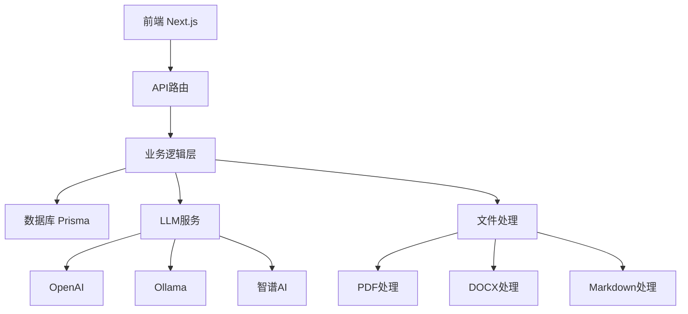

# 🏥 MED-Dataset 2.0 项目展示

## 📊 项目统计
- **⭐ Stars**: 
- **🍴 Forks**: 
- **📋 Issues**: 
- **🔧 Language**: 
- **📄 License**: 

## 🎯 核心亮点

### 🏥 专业医疗领域
- 专为医疗数据集生成设计
- 支持医疗文档智能解析
- 医疗问答对自动生成

### 🤖 AI驱动
- 集成多种大语言模型
- 智能文本分割算法
- 自动问题生成与优化

### 🛠️ 技术栈现代化
- **前端**: Next.js 14 + React 18
- **UI**: Material-UI + Emotion
- **后端**: Node.js + Prisma
- **桌面端**: Electron
- **部署**: Docker支持

### 🌐 多平台支持
- Web应用
- 桌面应用 (Windows/macOS/Linux)
- Docker容器部署

## 📈 技术架构



## 🚀 部署选项

### 1. 本地开发
```bash
npm install
npm run dev
```

### 2. 生产部署
```bash
npm run build
npm start
```

### 3. Docker部署
```bash
docker build -t med-dataset .
docker run -p 1717:1717 med-dataset
```

### 4. 桌面应用
```bash
npm run electron-build
```

## 📊 性能特性
- ⚡ 快速文档处理
- 🔄 异步任务管理
- 💾 本地数据存储
- 🔐 安全文件处理

## 🎨 用户界面
- 🌙 深色/浅色主题
- 🌍 中英文支持
- 📱 响应式设计
- ♿ 无障碍友好

## 🤝 开源贡献
欢迎参与项目贡献！查看 [CONTRIBUTING.md](CONTRIBUTING.md) 了解详情。

## 📞 联系方式
- **GitHub**: [@2023Anita](https://github.com/2023Anita)
- **Email**: support@med-dataset.com
- **Issues**: [项目问题反馈](https://github.com/2023Anita/med-dataset-2.0/issues)

---
⭐ 如果这个项目对您有帮助，请给我们一个Star！ 