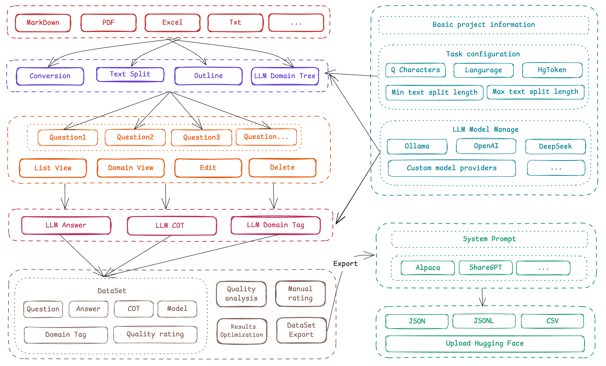
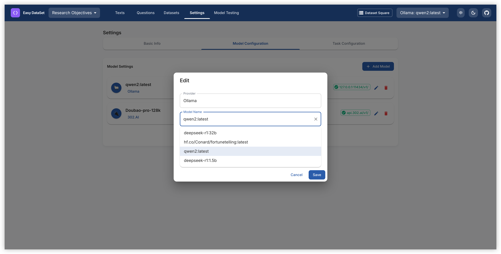
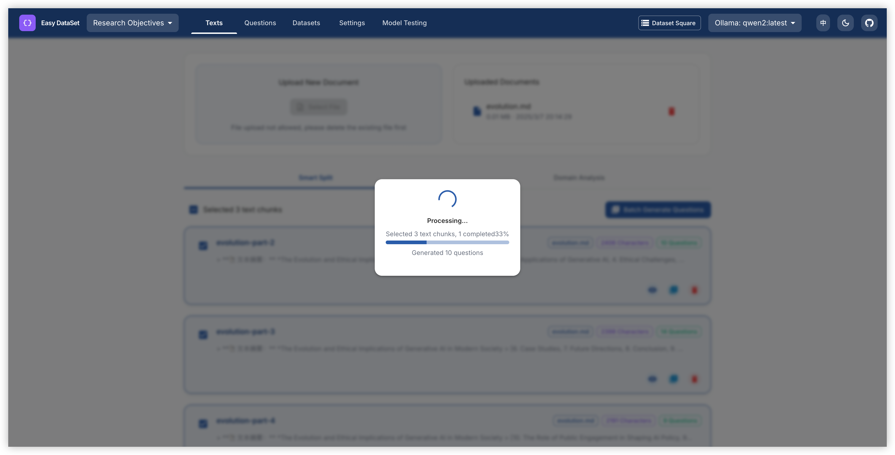
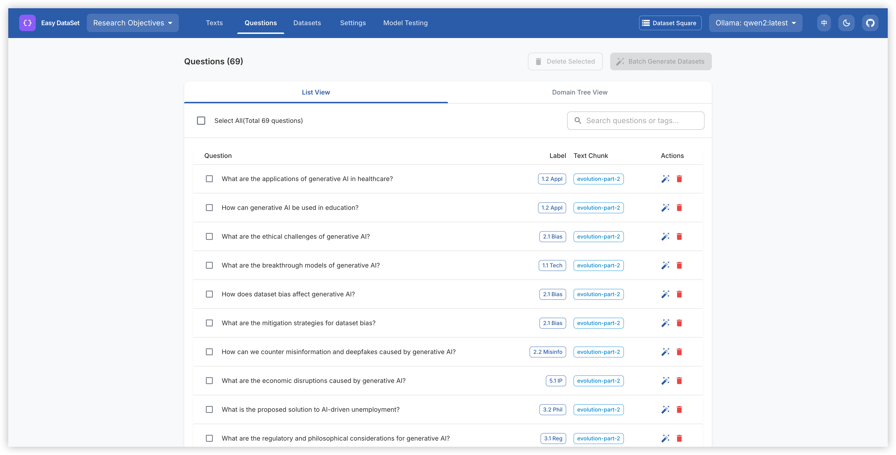
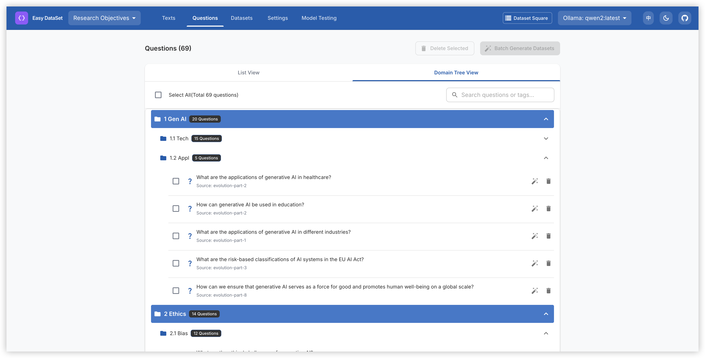
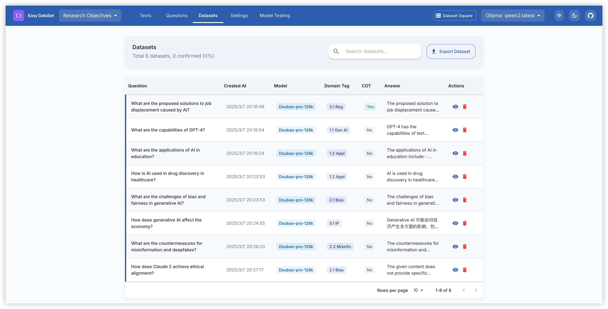
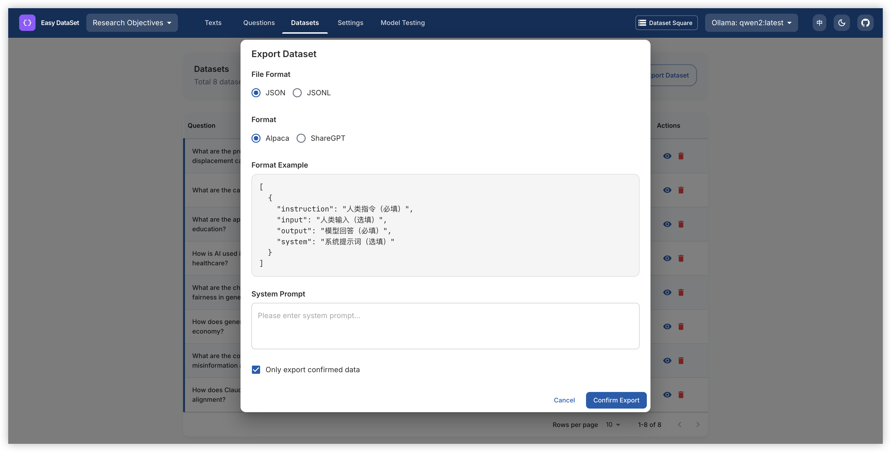
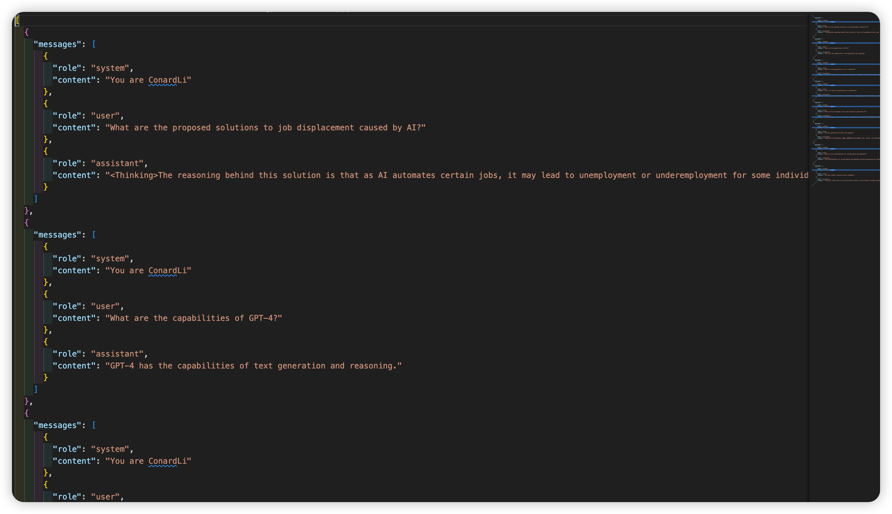

<div align="center">


**Professional Medical Dataset Generation & Management Platform**

[简体中文](./README.zh-CN.md) | [English](./README.md)

[Features](#features) • [Quick Start](#local-run) • [Contributing](#contributing) • [License](#license)

If you like this project, please give it a Star⭐️, or buy the author a coffee => [Donate](./public/imgs/aw.jpg) ❤️!

</div>

## Overview

MED-Dataset is a professional platform specifically designed for medical dataset generation and management. It provides an intuitive interface for creating, processing, and managing high-quality datasets for machine learning and AI applications in the medical field, helping researchers and medical professionals build robust training data.

With MED-Dataset, you can transform medical documents into structured datasets, supporting medical AI research and clinical decision support systems.



## Features

- **Medical Document Processing**: Support for importing and processing various medical document formats (PDF, DOCX, Markdown)
- **Intelligent Text Splitting**: Advanced text segmentation algorithms optimized for medical content
- **AI-Powered Question Generation**: Automatic generation of high-quality questions from medical texts
- **Dataset Creation**: Generate structured datasets with questions and answers for ML training
- **Multi-LLM Support**: Integration with multiple AI providers (OpenAI, Ollama, Zhipu AI, etc.)
- **Data Management**: Secure data storage and project management capabilities
- **Export Options**: Support for multiple dataset formats (Alpaca, ShareGPT, JSON, JSONL)
- **User-Friendly Interface**: Intuitive interface designed for medical researchers and data scientists
- **Multi-Platform Support**: Available as web application, desktop app, and Docker container
- **Internationalization**: Support for multiple languages (English, Chinese)

## Quick Demo

https://github.com/user-attachments/assets/6ddb1225-3d1b-4695-90cd-aa4cb01376a8

## Local Run

### Download Client

<table style="width: 100%">
  <tr>
    <td width="20%" align="center">
      <b>Windows</b>
    </td>
    <td width="30%" align="center" colspan="2">
      <b>MacOS</b>
    </td>
    <td width="20%" align="center">
      <b>Linux</b>
    </td>
  </tr>
  <tr style="text-align: center">
    <td align="center" valign="middle">
      <a href='https://github.com/ConardLi/easy-dataset/releases/latest'>
        
        <br />
        <b>Setup.exe</b>
      </a>
    </td>
    <td align="center" valign="middle">
      <a href='https://github.com/ConardLi/easy-dataset/releases/latest'>
        
        <br />
        <b>Intel</b>
      </a>
    </td>
    <td align="center" valign="middle">
      <a href='https://github.com/ConardLi/easy-dataset/releases/latest'>
        
        <br />
        <b>M</b>
      </a>
    </td>
    <td align="center" valign="middle">
      <a href='https://github.com/ConardLi/easy-dataset/releases/latest'>
        
        <br />
        <b>AppImage</b>
      </a>
    </td>
  </tr>
</table>

### Install with NPM

1. Clone the repository:

```bash
   git clone https://github.com/ConardLi/med-dataset.git
   cd med-dataset
```

2. Install dependencies:

```bash
   npm install
```

3. Start the development server:

```bash
   npm run build

   npm run start
```

4. Open your browser and visit `http://localhost:1717`

### Build with Local Dockerfile

If you want to build the image yourself, you can use the Dockerfile in the project root:

1. Clone the repository:
   ```bash
   git clone https://github.com/ConardLi/med-dataset.git
   cd med-dataset
   ```
2. Build the Docker image:
   ```bash
   docker build -t med-dataset .
   ```
3. Run the container:

   ```bash
   docker run -d -p 1717:1717 -v {YOUR_LOCAL_DB_PATH}:/app/local-db --name med-dataset med-dataset
   ```

   **Note:** Please replace `{YOUR_LOCAL_DB_PATH}` with the actual path where you want to store the local database.

4. Open your browser and visit `http://localhost:1717`

## How to Use

### Create a Project

<table>
    <tr>
        <td></td>
        <td></td>
    </tr>
</table>

1. Click the "Create Project" button on the homepage;
2. Enter a project name and description;
3. Configure your preferred LLM API settings

### Process Documents

<table>
    <tr>
        <td></td>
        <td></td>
    </tr>
</table>

1. Upload your files in the "Text Split" section (supports PDF, Markdown, txt, DOCX);
2. View and adjust the automatically split text segments;
3. View and adjust the global domain tree

### Generate Questions

<table>
    <tr>
        <td></td>
        <td></td>
    </tr>
</table>

2. Batch construct questions based on text blocks;
3. View and edit the generated questions;
4. Organize questions using the label tree

### Create Datasets

<table>
    <tr>
        <td></td>
        <td></td>
    </tr>
</table>

1. Batch construct datasets based on questions;
2. Generate answers using the configured LLM;
3. View, edit, and optimize the generated answers

### Export Datasets

<table>
    <tr>
        <td></td>
        <td></td>
    </tr>
</table>

1. Click the "Export" button in the Datasets section;
2. Choose your preferred format (Alpaca or ShareGPT);
3. Select the file format (JSON or JSONL);
4. Add custom system prompts as needed;
5. Export your dataset

## Project Structure

```
med-dataset/
├── app/                                # Next.js application directory
│   ├── api/                            # API routes
│   │   ├── llm/                        # LLM API integration
│   │   │   ├── ollama/                 # Ollama API integration
│   │   │   └── openai/                 # OpenAI API integration
│   │   ├── projects/                   # Project management API
│   │   │   ├── [projectId]/            # Project-specific operations
│   │   │   │   ├── chunks/             # Text chunk operations
│   │   │   │   ├── datasets/           # Dataset generation and management
│   │   │   │   ├── generate-questions/ # Batch question generation
│   │   │   │   ├── questions/          # Question management
│   │   │   │   └── split/              # Text splitting operations
│   │   │   └── user/                   # User-specific project operations
│   ├── projects/                       # Frontend project pages
│   │   └── [projectId]/                # Project-specific pages
│   │       ├── datasets/               # Dataset management UI
│   │       ├── questions/              # Question management UI
│   │       ├── settings/               # Project settings UI
│   │       └── text-split/             # Text processing UI
│   └── page.js                         # Homepage
├── components/                         # React components
│   ├── datasets/                       # Dataset-related components
│   ├── home/                           # Homepage components
│   ├── projects/                       # Project management components
│   ├── questions/                      # Question management components
│   └── text-split/                     # Text processing components
├── lib/                                # Core libraries and tools
│   ├── db/                             # Database operations
│   ├── i18n/                           # Internationalization
│   ├── llm/                            # LLM integration
│   │   ├── common/                     # Common LLM tools
│   │   ├── core/                       # Core LLM clients
│   │   └── prompts/                    # Prompt templates
│   │       ├── answer.js               # Answer generation prompts (Chinese)
│   │       ├── answerEn.js             # Answer generation prompts (English)
│   │       ├── question.js             # Question generation prompts (Chinese)
│   │       ├── questionEn.js           # Question generation prompts (English)
│   │       └── ... other prompts
│   └── text-splitter/                  # Text splitting tools
├── locales/                            # Internationalization resources
│   ├── en/                             # English translations
│   └── zh-CN/                          # Chinese translations
├── public/                             # Static resources
│   └── imgs/                           # Image resources
└── local-db/                           # Local file database
    └── projects/                       # Project data storage
```

## Documentation

- View the demo video of this project: [MED-Dataset Demo Video](https://www.bilibili.com/video/BV1y8QpYGE57/)

## Community Practice

[MED-Dataset × LLaMA Factory: Enabling LLMs to Efficiently Learn Domain Knowledge](https://buaa-act.feishu.cn/wiki/GVzlwYcRFiR8OLkHbL6cQpYin7g)

## Contributing

We welcome contributions from the community! If you'd like to contribute to MED-Dataset, please follow these steps:

1. Fork the repository
2. Create a new branch (`git checkout -b feature/amazing-feature`)
3. Make your changes
4. Commit your changes (`git commit -m 'Add some amazing feature'`)
5. Push to the branch (`git push origin feature/amazing-feature`)
6. Open a Pull Request (submit to the DEV branch)

Please ensure that tests are appropriately updated and adhere to the existing coding style.

## Join Discussion Group & Contact the Author

Contact information available in the project repository.

## License

This project is licensed under the AGPL 3.0 License - see the [LICENSE](LICENSE) file for details.

## Star History

[](https://www.star-history.com/#ConardLi/med-dataset&Date)

<div align="center">
  <sub>Built with ❤️ by <a href="https://github.com/ConardLi">ConardLi</a> • Follow me: <a href="./public/imgs/weichat.jpg">WeChat Official Account</a>｜<a href="https://space.bilibili.com/474921808">Bilibili</a>｜<a href="https://juejin.cn/user/3949101466785709">Juejin</a>｜<a href="https://www.zhihu.com/people/wen-ti-chao-ji-duo-de-xiao-qi">Zhihu</a>｜<a href="https://www.youtube.com/@garden-conard">Youtube</a></sub>
</div>
